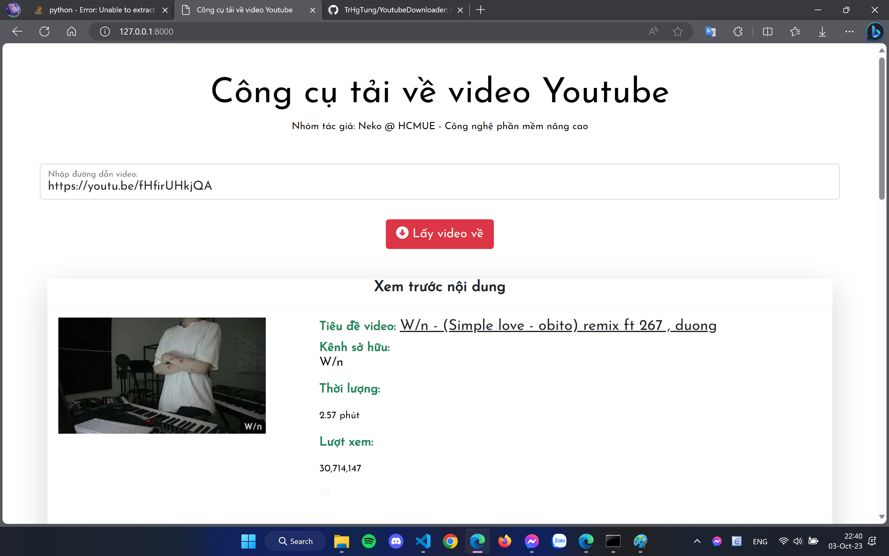
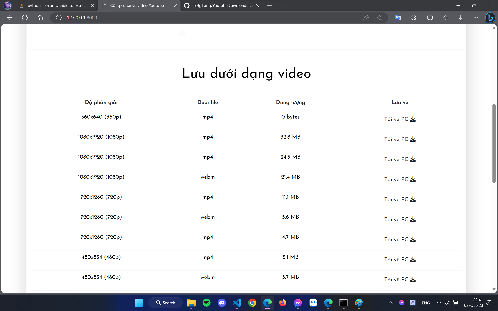

<h1 align='center'>Youtube Video Downloader</h1>
<p align='center'>YouTube Video Downloader is a simple Python Web application built with Django</p>
<p>youtube-dll module is used: <a href="https://github.com/ytdl-org/youtube-dl">youtube-dll</a></p>

## Source Code

[](https://github.com/TrHgTung/YoutubeDownloader)

## Requirements

This App Uses

```
asgiref==3.5.1
Django==3.2.3
pytz==2022.1
sqlparse==0.4.2
typing-extensions==4.2.0
youtube-dl==2021.12.17
```

# Installation

```sh
$ git clone https://github.com/TrHgTung/YoutubeDownloader.git
$ cd youtube-video-downloader
$ python -m venv venv
if you are using windows:
$.\venv\Scripts\activate
if you are using linux
$source venv/bin/activate
$ pip install -r requirements.txt
$ python manage.py runserver
```

## Screenshots

<p align="center">
    
    
</p>

`Origin: Github@alii76tt`
